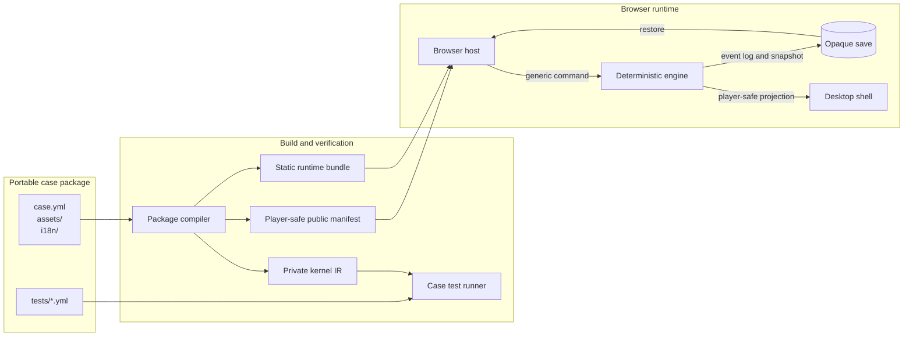

<p align="center">
  <picture>
    <source media="(prefers-color-scheme: dark)" srcset="docs/brand/opencase-logo-dark.png">
    <source media="(prefers-color-scheme: light)" srcset="docs/brand/opencase-logo-light.png">
    
  </picture>
</p>

<h1 align="center">opencase</h1>

<p align="center">
  A deterministic detective game engine and a browser desktop.
</p>

<p align="center">
  <a href="https://github.com/f/opencase/actions/workflows/deploy-pages.yml"></a>
  <a href="LICENSE"></a>
</p>

<p align="center">
  <a href="https://opencase.computer"><strong>Play the game</strong></a>
  ·
  <a href="https://github.com/f/opencase">Source code</a>
  ·
  <a href="docs/case-yaml-reference.md">Write a case</a>
</p>

opencase runs investigation stories from portable YAML packages. A case owns
its story, translations, media, and tests. The engine owns generic commands,
events, rules, clocks, and saves. The browser app connects them through a
player-safe projection, without adding case-specific logic to React or
TypeScript.

The production game is fully static. It includes a desktop, case notebook,
case board, inbox, phone, files, research, local player profiles, and per-case
progress.

## Features

- Portable case folders with YAML, images, audio, translations, and tests
- Deterministic command → event → reducer → rule execution
- Case tests written from the detective's point of view
- Multilingual case catalogs
- Browser-local profiles, saves, imports, and desktop layouts
- Static deployment with no gameplay server or database
- A decoupling gate that rejects case IDs and story tokens in engine code

## Quick start

You need a current Node.js release and `npm`.

```bash
git clone https://github.com/f/opencase.git
cd opencase
npm install
npm run dev
```

Open <http://127.0.0.1:4173>.

Run the complete repository gate before opening a pull request:

```bash
npm run check
```

## Case packages

Every case is a self-contained, lowercase kebab-case folder:

```text
cases/
└── my-first-case/
    ├── case.yml
    ├── assets/
    │   └── room-photo.webp
    ├── i18n/
    │   ├── en.yml
    │   └── tr.yml
    └── tests/
        └── shortest-solution.yml
```

`case.yml` is the only source of story logic. `assets/` contains media,
`i18n/` contains player-facing text, and `tests/` contains executable case
scenarios. A new case does not require an engine or app change.

A source file begins with engine-independent data like this (excerpt):

```yaml
schema: case-source/v0.1
case:
  id: my_first_case
  version: 1.0.0
  locale: en
  title: The First Clue
  duration: 5m
  mode: elastic
  final_conclusion: first-write-wins
  time: {date: "2026-01-01", timezone: UTC, starts_at: "09:00"}
  synopsis: A mug shows where the courier stopped.

use: [investigation@1, artifacts@1]

# Cast, places, things, truth, and perspectives are authored here.
opening:
  call: {from: dispatcher, text: Start with the mug photo.}
  grants: [mug_photo]
  starts: []

evidence:
  mug_photo:
    tool: image
    at: start
    reports: {place: hall}
```

Use a [tiny example](examples/cases/README.md) for a complete working package.
The [YAML reference](docs/case-yaml-reference.md) explains every field, and the
[case-test reference](docs/detective-tests.md) explains `tests/*.yml`.

Compile and test one package:

```bash
npx tsx scripts/compile-cases.ts cases/my-first-case
npx tsx src/simulator/cli.ts cases/my-first-case
```

## Architecture



The boundaries are strict:

| Layer | Owns | Must not own |
| --- | --- | --- |
| Case | Story, evidence, routes, translations, assets, tests | Engine code, UI code, player data |
| Engine | Generic commands, events, rules, clocks, projections, saves | Case IDs, character names, authored routes, windows |
| Browser host | Runtime loading, imports, save slots, asset resolution | Case-specific gameplay rules |
| Desktop shell | Windows, visual state, input, animations | Hidden truth or duplicate gameplay state |

Read [Architecture](docs/architecture.md) for the full execution, persistence,
and asset model. Normative rules are in the
[engine contract](docs/engine-contract.md).

## Static build

```bash
npm ci
npm run build
```

The output is in `dist/`. It works at a domain root or a repository subpath.
GitHub Actions checks the project, builds it, and deploys it to Pages.

Static runtime bundles contain complete case mechanics. Someone who inspects
downloaded JSON or JavaScript can find the answers. The projection boundary
keeps normal gameplay honest, but it is not a secrecy boundary against source
inspection.

## Documentation

| Document | Use it for |
| --- | --- |
| [Case YAML reference](docs/case-yaml-reference.md) | Fields, expressions, validation, and examples |
| [Case localization](docs/case-i18n.md) | `$text` catalogs, fallback, and digest rules |
| [Detective case tests](docs/detective-tests.md) | Scenario steps, public assertions, and diagnostics |
| [Tiny case examples](examples/cases/README.md) | Small packages you can copy and change |
| [AI case-authoring skill](docs/ai-case-authoring-skill.md) | Writing a case with an AI workflow |
| [Architecture](docs/architecture.md) | Data flow, state ownership, replay, and assets |
| [Engine contract](docs/engine-contract.md) | Normative kernel and public-boundary rules |
| [Profiles and case library](docs/player-profiles-and-case-library.md) | Saves, GitHub imports, and verification labels |
| [Desktop shell](src/shell/README.md) | Window behavior and shell-state boundaries |
| [Development and deployment](docs/development.md) | Commands, generated files, repository map, and Pages |
| [Example research](docs/real-world-case-examples.md) | Sources used for realistic fictional cases |
| [Third-party assets](docs/THIRD_PARTY_ASSETS.md) | Interface asset origins and licenses |

## Project status

opencase is an early working demo (`0.1.0`). The engine, browser host, desktop,
built-in cases, case compiler, and conformance runner work together. The case
schema and save compatibility may still change before a stable release.

## License

opencase is free software licensed under the
[GNU General Public License version 2 or later](LICENSE)
(`GPL-2.0-or-later`). Third-party assets keep their respective licenses; see
[Third-party assets](docs/THIRD_PARTY_ASSETS.md) for details.

## Contributing

Issues and pull requests are welcome. Keep each change inside the layer that
owns the behavior. In particular, do not solve a case-authoring problem with a
case-specific condition in the engine or app.

Before submitting a change, add the smallest relevant tests, run
`npm run check`, and review generated public manifests for unintended private
story data. More details are in
[Development and deployment](docs/development.md).
